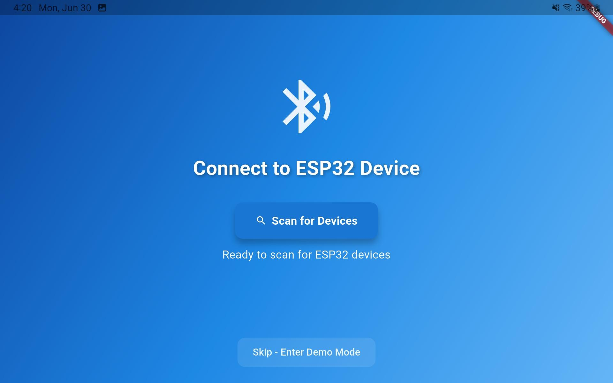
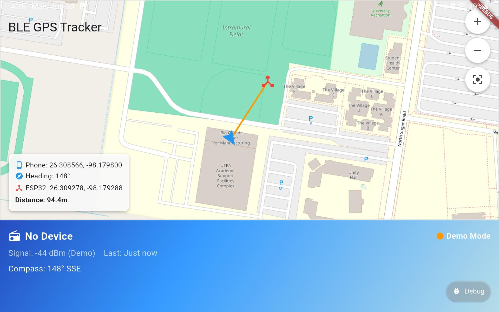

# Tracker App (Flutter)

A prototype Flutter application designed to work with a custom-built tracking device, similar in concept to Apple AirTag.  

---

## Overview  
- Connects to a physical tracker via Bluetooth Low Energy (BLE)
- Calculates the device’s coordinates.
- Periodically checks location and connection status.  
- Sends a notification alert if the user moves out of range  

---

## Features  
- BLE connection with a custom tracker device  
- GPS-based location display in the app  
- Background monitoring of location and connection  
- Notifications to help prevent loss when moving away
- Map view displaying the tracker’s location and the user’s device position

  
### Demo
[Watch the Demo on YouTube](https://www.youtube.com/shorts/hxWV5kCJoWA)

### Connection Screen  
  

### Map View  
  

